# NewsWatch

  NewsWatch is an example iOS application that uses Bluemix Push Notification service, Openwhisk, Cloudant and Watson Text to Speech service.

  NewsWatch will will send give you latest news based on your preference. Once you subscribe for your interested topic , you will rceive a push notification every hour with the latest news. If you don't want to miss out the latest news you can enable the `Play Push Notification` option in the app to readout the news.


   

## Requirements
  * iOS 10.+
  * Xcode 8.+

## Create Following Bluemix services
    Go to https://console.ng.bluemix.net and Log in. Click on [Catalog](https://console.ng.bluemix.net/catalog/) on the top bar. On the left pane click on `Boiler Plates` below Apps.
  1. Create [MobileFirst service starter] app. This will have `Push notification service`.

        

  2. Click on [Catalog](https://console.ng.bluemix.net/catalog/) on the top bar. On the left pane click on `Watson` below `Services`.Create a `Watson Text to speech` service.

      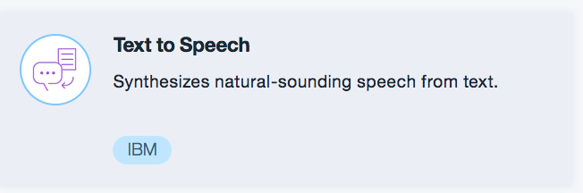

## Create APNS Certificate

  For getting push notifications APNs certificate is mandatory. Create a `Development profile` and `Development provisioning profile` in your [Apple developer](https://developer.apple.com/account) account after that follow the below steps,

  1. Open the `Certificates, IDs & profiles` section

     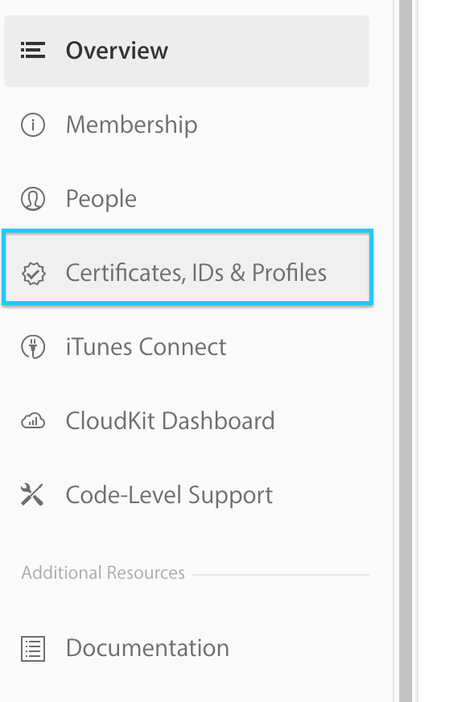

  2. Go to the `App IDs` section and create a bundle identifier and enable push notifications

     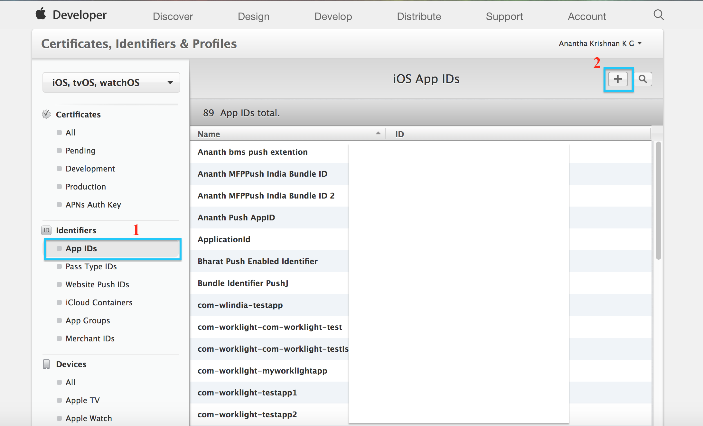

  3. Go to the `Edit` section and add `Development SSL Certificate` under `Push notification` section

     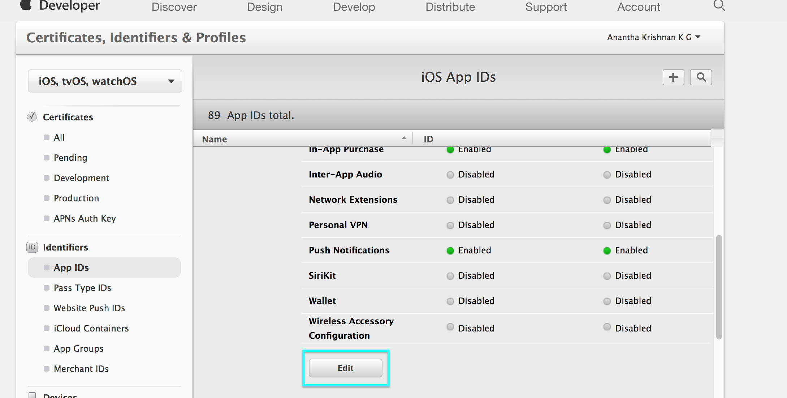 

  4. Download the certificate and double click on it, certificate will get added to the `Keyachain`

     

  5. Right click on the certificate and select export option. Save it as a `p12` with valid password.

     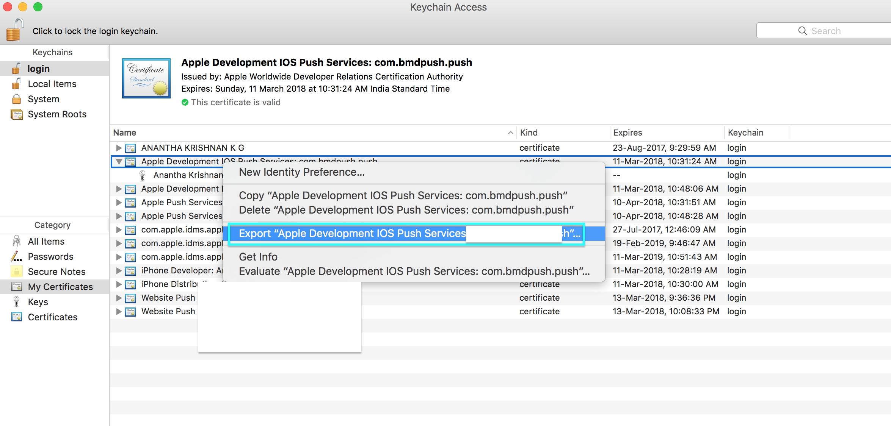


## Set Up iOS app

 Point the terminal to `NewsSeconds` folder and do `pod install`. This will add Cocoapod dependencies to the app.

 Follow the below steps,

 1. Open the `NewsSeconds.xcworkspace` in `Xcode` (make sure you are using Xcode 8+)
 2. Go to General and `Uncheck the auto signing`

   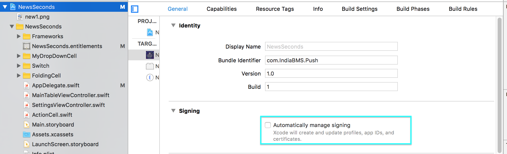

 3. Add you bundle Identifier that you created [here](#Create-APNS-Certificate)

  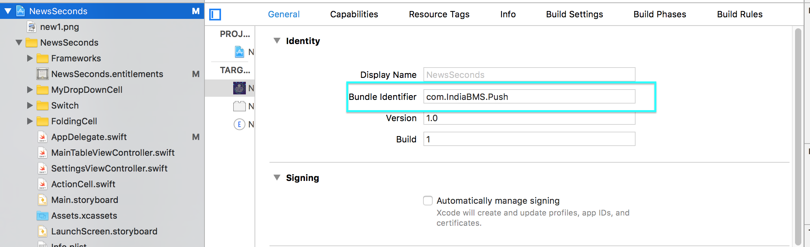

 4. Go to the `Build settings -> Signing` section. Add your `provisioning profile`, `Code signing Identity` and `Development team`.

   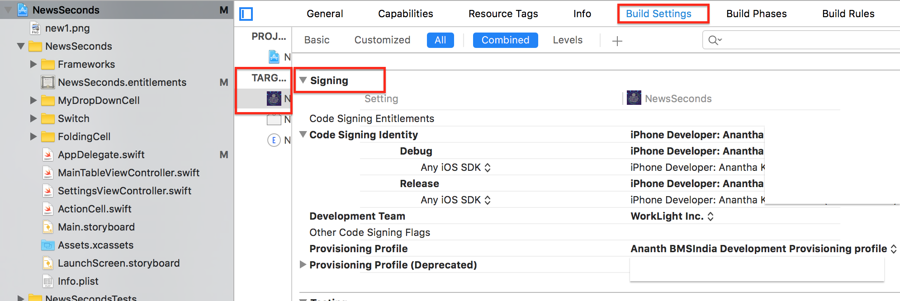  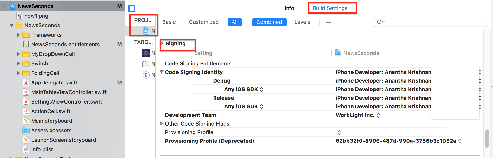

 5. Open the `Capabilities` and add `Push notifications`, `backgound Modes`

     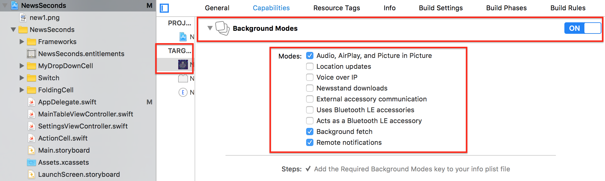

 6. Open the  `AppDelegate.swift` file and add values for the following ,

   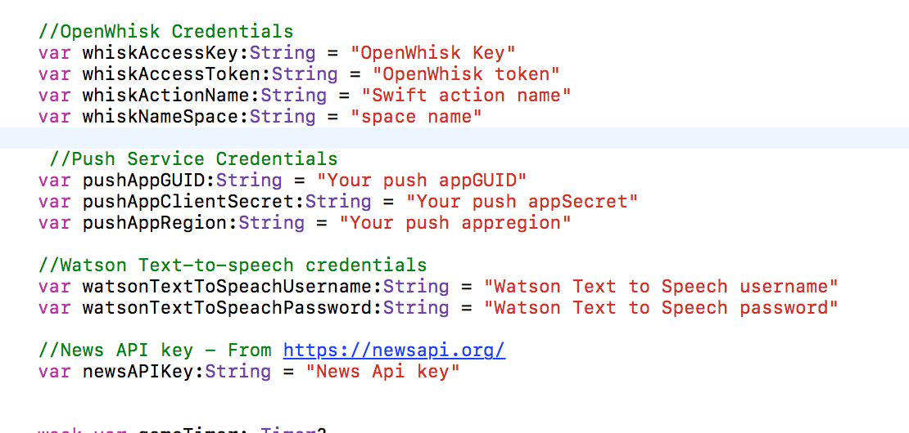

 8. Build the project.

## Create openWhisk action

Go to [OpenWhisk Web editor](https://console.ng.bluemix.net/openwhisk/editor) .

1. Create an openWhisk action named `GetLatestNewsAPI` and add the code from `openWhisk/GetLatestNewsAPI.swift`

   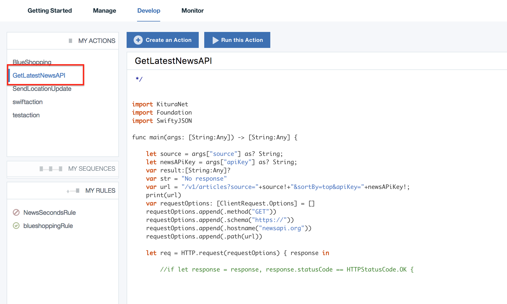

2. Create another openWhisk action with the code `openWhisk/SwiftAction.swift` add values for the following .

   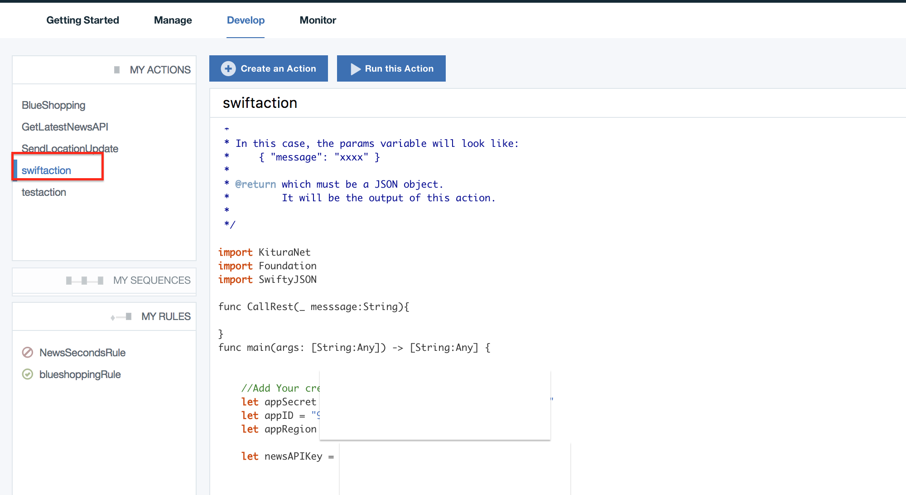 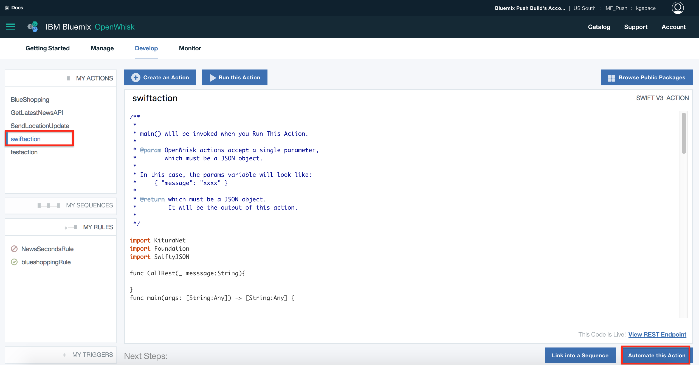

3. create a alarm based trigger for the above action (step 2)

   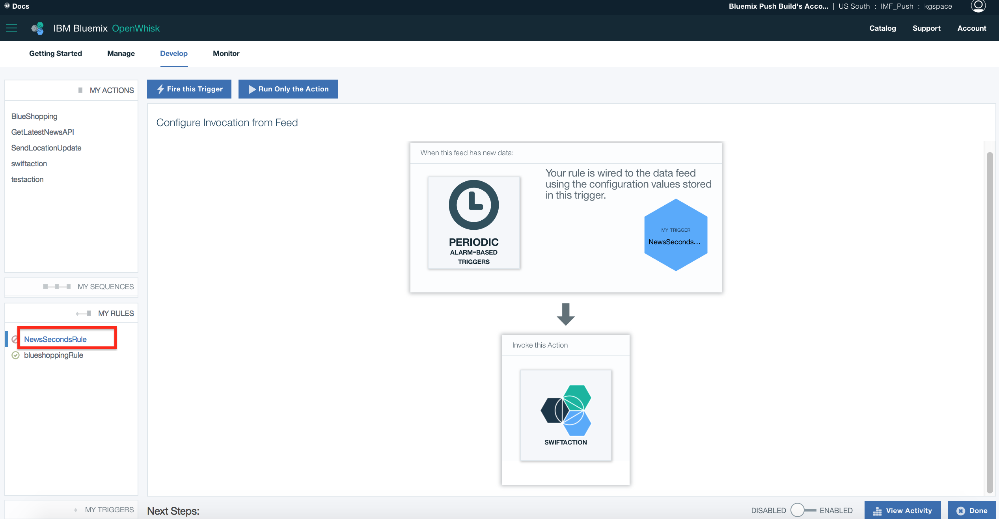


## Config Push Service

 Open your `Bluemix push service` and configure for `iOS`
 Create the following tags in push service

 ```
  {
    {
     "name": "reddit-r-all",
     "description": "Reddit"
     },
   {
     "name": "cnn",
     "description": "CNN general news tag"
     },
   {
     "name": "bloomberg",
     "description": "Bloomberg business tags news"
   },
   {
     "name": "business-insider-uk",
     "description": "Business Insider business"
   },
   {
     "name": "bbc-sport",
     "description": "BBC Sport news tag"
   },
   {
     "name": "financial-times",
     "description": "Financial Times business"
   },
   {
     "name": "t3n",
     "description": "T3n technology"
   },
   {
     "name": "google-news",
     "description": "Google News general"
   },
   {
     "name": "the-wall-street-journal",
     "description": "The Wall Street Journal"
   },
   {
     "name": "buzzfeed",
     "description": "Buzzfeed entertainment"
   },
   {
     "name": "abc-news-au",
     "description": "ABC News (AU) news tag"
   },
   {
     "name": "time",
     "description": "Time general"
   },
   {
     "name": "usa-today",
     "description": "USA Today general"
   }
  }
 ```

## Run iOS application.

  Run the iOS application . Go to settings page and enable `Push notifications`, `Play push notifications`. Select your favorite news channel from the dropdown.

Thats it folks !!!..

## License

Copyright 2016 IBM Corp.

Licensed under the Apache License, Version 2.0 (the "License"); you may not use this file except in compliance with the License. You may obtain a copy of the License at

http://www.apache.org/licenses/LICENSE-2.0

Unless required by applicable law or agreed to in writing, software distributed under the License is distributed on an "AS IS" BASIS, WITHOUT WARRANTIES OR CONDITIONS OF ANY KIND, either express or implied. See the License for the specific language governing permissions and limitations under the License.
